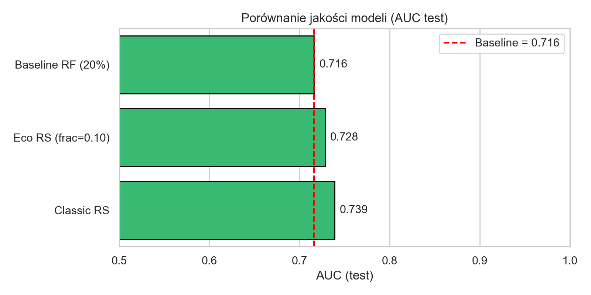
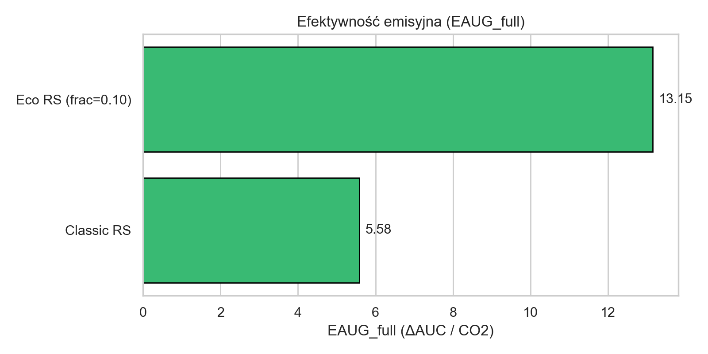
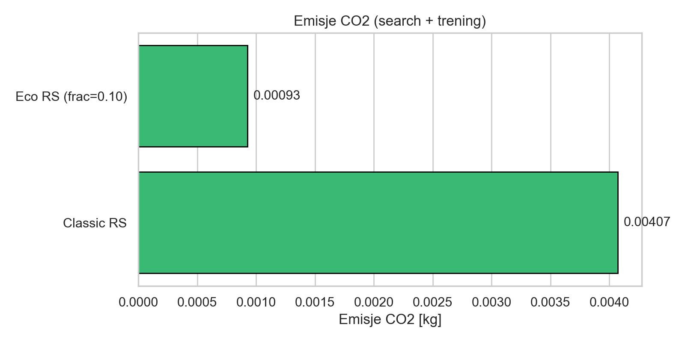
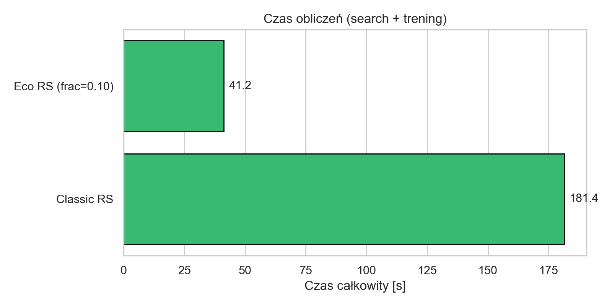

# 🌿EcoSearch – ekologiczna optymalizacja modeli ML

EcoSearch to narzędzie do optymalizacji modeli uczenia maszynowego z uwzględnieniem ich wpływu na środowisko.

Metryką optymalizowaną przez EcoSearch jest **EAUG (Emission-Adjusted AUC Gain)**:

$$\text{EAUG} = \frac{\Delta \text{AUC}}{CO_2},$$

gdzie $\Delta \text{AUC}$ to różnica między AUC modelu a wartością bazową (baseline).

---

## Eksperymenty sprawdzające czy rozwiązanie ma sene

Aby ocenić sensowność podejścia EcoSearch, przeprowadziliśmy eksperymenty porównujące ekologiczność, czas treningu i jakość modeli uzyskanych za pomocą EcoSearch z tradycyjnymi metodami optymalizacji hiperparametrów (*random search*).  

Wyniki pokazały, że EcoSearch pozwala na uzyskanie modeli o porównywalnej jakości (AUC) przy znacznie niższej emisji CO₂ i krótszym czasie treningu.









---

## Funkcje dostępne w EcoSearch

### `eco_random_search`

Ekologiczna wersja *random search*:

- losuje hiperparametry z zadanych rozkładów,
- **zawsze** trenuje model na tej samej frakcji danych (`data_fraction`),
- mierzy emisje CO₂ (kg) za pomocą CodeCarbon,
- oblicza AUC,
- liczy EAUG dla każdej konfiguracji,
- wybiera konfigurację z **maksymalnym EAUG**.

Parametry:

- `X` – macierz zmiennych
- `y` – wektor etykiet
- `param_distributions` – słownik list rozważanych wartości hiperparametrów  
- `data_fraction` – frakcja danych używana przy każdym treningu  
- `baseline_auc` – AUC modelu bazowego  
- `n_iter` – liczba wylosowanych konfiguracji  
- `auc_min` – minimalne wymagane AUC  
- `random_state` – seed  
- `project_name` – nazwa projektu dla CodeCarbon  

Zwraca:

1. `df` – DataFrame z wynikami wszystkich iteracji  
2. `best_config` – słownik najlepszego modelu wg EAUG  

---

### `eco_grid_search`

Ekologiczna wersja *grid search*:

- iteruje po wszystkich kombinacjach hiperparametrów (`param_grid`),
- używa tej samej frakcji danych (`data_fraction`) dla każdego modelu,
- mierzy emisje CO₂ (kg) za pomocą CodeCarbon,
- oblicza AUC oraz EAUG,
- wybiera konfigurację z **maksymalnym EAUG**.

Parametry:

- `X` – macierz zmiennych
- `y` – wektor etykiet
- `param_grid` - słownik z siatką hiperparametrów do przeszukania
- `data_fraction` - frakcja danych używana przy każdym treningu
- `baseline_auc` - AUC modelu bazowego
- `max_evals` - maksymalna liczba konfiguracji do przeszukania (jeśli liczba kombinacji jest większa, losowane są `max_evals` konfiguracji)
- `auc_min` - minimalne wymagane AUC
- `random_state` - seed
- `project_name` - nazwa projektu dla CodeCarbon

Zwraca:

1. `df` - DataFrame z wynikami wszystkich iteracji
2. `best_config` - słownik najlepszego modelu wg EAUG

---

## Przykład użycia — `eco_random_search`

Poniższy przykład demonstruje, jak uruchomić ekologiczny random search dla klasyfikatora Random Forest:

```python
import numpy as np
import pandas as pd
from sklearn.datasets import load_breast_cancer
from sklearn.model_selection import train_test_split
from sklearn.metrics import roc_auc_score
from sklearn.ensemble import RandomForestClassifier

# Import funkcji eco_random_search
from eco_search import eco_random_search


# Wczytanie danych
data = load_breast_cancer()
X, y = data.data, data.target

X_train, X_test, y_train, y_test = train_test_split(
    X, y, test_size=0.2, random_state=42
)

# Obliczenie AUC modelu baseline
baseline_model = RandomForestClassifier(random_state=42)
baseline_model.fit(X_train, y_train)
baseline_auc = roc_auc_score(y_test, baseline_model.predict_proba(X_test)[:, 1])

print("Baseline AUC =", baseline_auc)

# Rozkłady hiperparametrów do przeszukania
param_distributions = {
    "n_estimators": [50, 100, 200, 300],
    "max_depth": [None, 5, 10, 20],
    "min_samples_split": [2, 4, 8],
    "min_samples_leaf": [1, 2, 4],
}

# Uruchomienie eco_random_search
df_results, best_config = eco_random_search(
    X=X_train,
    y=y_train,
    param_distributions=param_distributions,
    data_fraction=0.10,
    baseline_auc=baseline_auc,
    n_iter=20,
    random_state=42,
    project_name="eco_demo"
)

print("\nNajlepsza konfiguracja wg EAUG:")
print(best_config)

print("\nTabela wyników:")
print(df_results.head())
```
